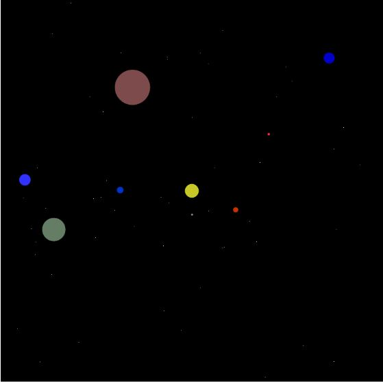

# Solar-System-Simulator

As you might have guessed, this is my code for a Solar Sytem simulator in javascript.
I used [p5.js](p5js.org) libraries, imported from [CDN.js](cdnjs.com/libraries/p5.js).

I tried my best to make it as legible as possible. Feel free to ask me anything, suggest any changes or point out any errors.

Basically, there is an ``index.html`` file where two files (``sketch.js`` and ``celestialBody.js``) are implemented. There is also a ``celestialBodies.json`` file that is dynamically changed by the JavaScript files but never saved. If you wanted to see the JSON file at any moment of the simulation, copy and paste in the web console the following line:

``` javascript
(JSON.stringify(celestialBodies, null, '   '))
```

The default program is a simple Sun, Earth and Moon simulation (nothing to scale, but actual relative orbit time), but you can comment out lines 22 to 24 and 55, 56 from ``sketch.js``, and replace it with the code in lines 26 to 34 and 57 to 64 respectively. That will output a simulation like this one:



Note that in this second simulation also keeps the relative orbit time, and it also keeps a real relative size (the first 4 planets are double its actual relatie size because of minimum needed pixel resolutions, and the sun is obiously not to scale at all, and so are the orbits radii).

I hope you like it.
